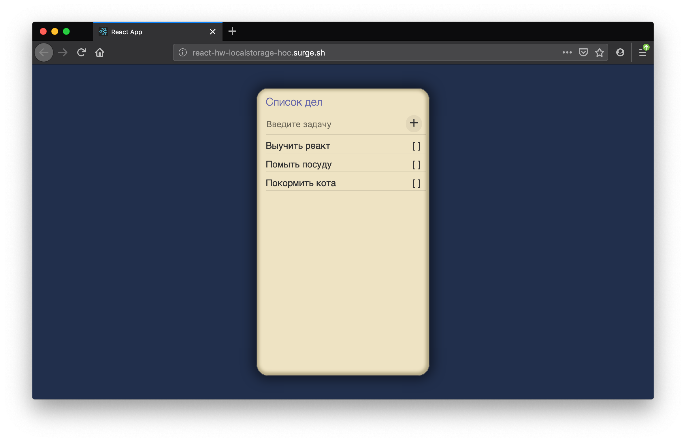

# Домашнее задание 5 - HOC

[Пример работы](http://react-hw-localstorage-hoc.surge.sh)


В данном домашнем задании вам необходимо создать hoc компонент, который будет
насыщять обернутый компонент 2мя пропсами. SavedData возвращает запись из
localstorage. SaveData сохраняет данные.

Компонент Todo не должен хранить в своем стейте ничего, кроме значения инпута,
сами данные по туду задачам должны всегда хранится в localstorage с помощью
методов из hoc.

---

### Памятка

#### 1. Зарегистрируйтесь на Гитхабе

Если у вас ещё нет аккаунта на [github.com](https://github.com/join), скорее зарегистрируйтесь.

#### 2. Установите `loftschool-react-cli`

Установите утилиту для получения домашних работ:

```
npm i -g loftschool-react-cli
```

Это позволит вам выполнять команду `react-course`

#### 3. Получите домашнюю работу

Убедитесь что вы находитесь в пустой папке. Выполните команду `react-course`, чтобы получить домашнюю работу:

```
react-course -h homework-1
```

#### 4. Начинайте обучение!

---

<a href="https://loftschool.com/course/react/"></a>

Репозиторий создан для обучения на профессиональном онлайн‑курсе «[React.js. Разработка веб-приложений](https://loftschool.com/course/react/)» от [Loftschool](https://loftschool.com/).